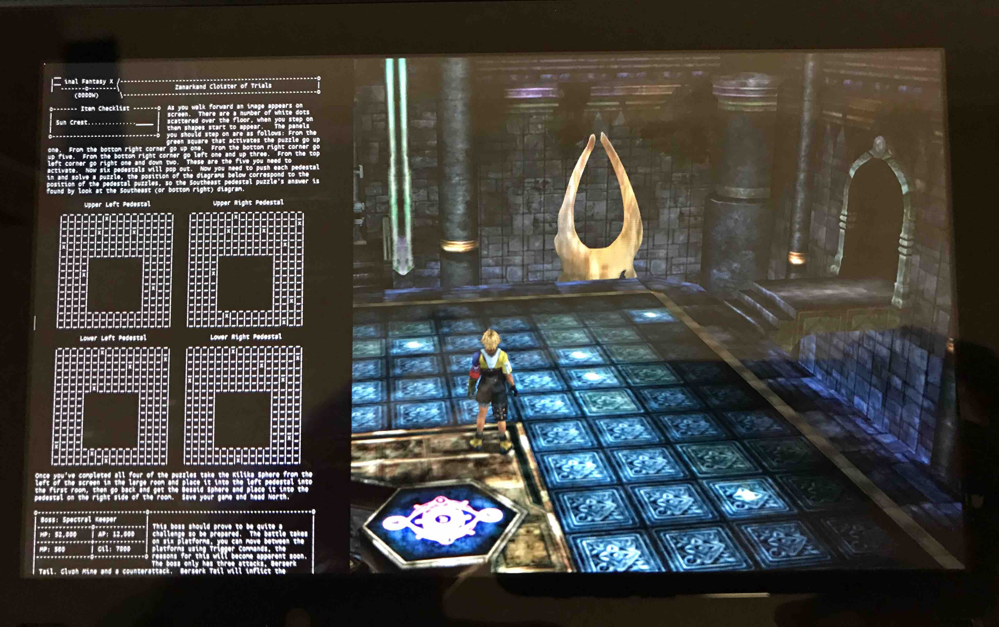

# TextReaderOverlay-NX Revived

A maintained compatibility fork of [diwo/TextReaderOverlay-NX](https://github.com/diwo/TextReaderOverlay-NX) for modern Nintendo Switch homebrew environments.

TextReaderOverlay is a Tesla overlay that lets you browse `.txt` files on the SD card and read them over any foreground application. This fork keeps the original idea and interface, while updating the code for current Atmosphere/libnx/libtesla toolchains and fixing several failures found on real hardware.

中文说明：[README_zh-CN.md](README_zh-CN.md)

## Why this fork exists

The original project is an excellent small utility, but its old build and runtime assumptions no longer matched current Atmosphere/libnx/libtesla releases. On a current Switch setup, the old overlay could be rejected by Atmosphere, fail to mount `sdmc:`, crash while browsing, or open a text file into an empty view.

This fork was rebuilt and tested on real hardware rather than only adjusted until it compiled. The most important fixes came from reproducing failures, reading crash reports, and testing each change on the console:

- migrated old libnx HID APIs and rebuilt against current libtesla;
- reduced the overlay footprint after an out-of-memory failure;
- mounted and unmounted `sdmc:` explicitly;
- replaced the unstable browser filesystem path with safe POSIX directory enumeration;
- fixed the zero-sized root `CustomDrawer` that clipped every reader glyph;
- added streamed text decoding for UTF-8, UTF-16, UTF-32, GB18030/GBK, and Windows-1252;
- used Nintendo's shared system fonts for Latin, Japanese, Simplified Chinese, Traditional Chinese, and Korean text;
- stopped rendering past EOF, preventing unrelated heap data from appearing after short files;
- fixed Help layout clipping on current libtesla.

## Requirements

- Nintendo Switch with Atmosphere
- Current `nx-ovlloader`
- Current Tesla Menu
- A text file with a `.txt` extension on the SD card

The release was tested on Atmosphere 1.11.2 / firmware 22.5.0. Other versions may work, but are not guaranteed.

## Installation

1. Install or update [nx-ovlloader](https://github.com/WerWolv/nx-ovlloader) on the SD card.
2. Install or update [Tesla Menu](https://github.com/WerWolv/Tesla-Menu) on the SD card.
3. Download the ZIP from the [Releases page](https://github.com/chiya695/TextReaderOverlay-NX-Revived/releases/latest) and extract it to the SD-card root.
4. Put `.txt` files anywhere on the SD card.
5. Reboot the Switch after installing or replacing the overlay. This is recommended during development because a hidden/running overlay may still be resident in memory.
6. Open Tesla Menu with `L + D-Pad Down + Right Stick Press`, then select `Text Reader`.
7. Choose `Browse...`, navigate to a text file, and press `A`.

If a previous version is still loaded, delete `sd:/switch/.overlays/TextReaderOverlay-NX.ovl`, copy the new file again, and reboot before testing.

## Controls

### File browser

- `A`: open a directory or text file
- `Y`: add/remove the selected path from Favorites
- `B`: go back

### Reader

- Left Stick: scroll
- `ZL` + Left Stick: scroll faster
- `ZR` + Left Stick: scroll much faster / jump to top or bottom
- Right Stick Up/Down: fine scrolling
- Right Stick Left/Right: pan horizontally
- Right Stick Press: reset horizontal pan
- D-Pad Up/Down: adjust font size
- `Y`: toggle bookmark
- `L` / `R`: previous/next bookmark
- `X`: hide the overlay
- `B`: close the reader
- `-`: toggle diagnostic information

## Text support

The reader detects and streams the following formats without loading the whole file into memory:

- UTF-8, with or without BOM
- UTF-16 little-endian / big-endian
- UTF-32 little-endian / big-endian
- GB18030 / GBK
- Windows-1252

Rendering uses Switch shared system fonts and does not bundle a large CJK font file. Large files are loaded in chunks to keep runtime memory bounded.

## Building

See [BUILD.md](BUILD.md). The project uses the devkitPro MSYS2 shell. A release build produces an SD-card layout ZIP suitable for direct extraction.

## Credits and licensing

- Original project and concept: [diwo/TextReaderOverlay-NX](https://github.com/diwo/TextReaderOverlay-NX)
- Tesla overlay framework: [WerWolv/libtesla](https://github.com/WerWolv/libtesla)
- Overlay loader: [WerWolv/nx-ovlloader](https://github.com/WerWolv/nx-ovlloader)
- Menu: [WerWolv/Tesla-Menu](https://github.com/WerWolv/Tesla-Menu)
- Custom firmware: [Atmosphere-NX/Atmosphere](https://github.com/Atmosphere-NX/Atmosphere)

This repository retains the original GPL license. See [LICENSE](LICENSE) and the licenses in vendored dependencies before redistributing modified builds.

## Disclaimer

Use custom firmware and overlays at your own risk. Keep backups of your SD card and configuration. This project is an unofficial community-maintained fork and is not affiliated with Nintendo, Atmosphere, Tesla Menu, or the original author.
